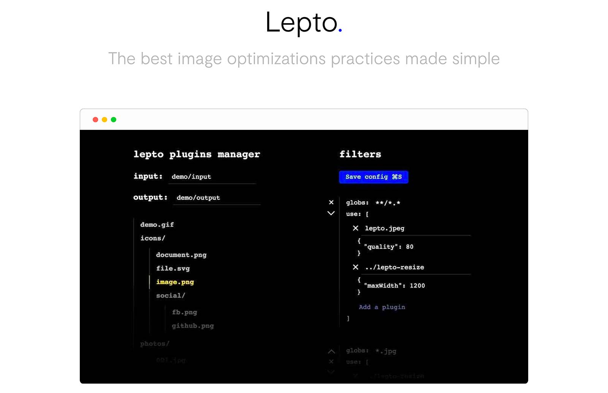

[](#get-started-with-cli--npm-scripts)

<p align="center">
  <a href="https://travis-ci.org/leptojs/lepto"></a>
</p>

The main purpose of this tool is to automate image optimization and analysis. 
This project is recent, so use it with care, I'm listening to all feedback (we 
can talk via [twitter][twitter], don't follow me I never tweet).

**What is the difference with [ImageMin][imagemin]?** I think that if you deal 
with large applications, then go on ImageMin, but if you are building small 
static websites and you want to optimize your resources easily, then you could 
try lepto.

You give to lepto your input and output directories, the plugins you want to 
use and their options. Then lepto does his job, you keep your original files 
and the structure of the input directory. Some plugins can even collect data 
(like primary colors) from your images and save them in a JSON file.

If you want to learn more about image optimizations, I recommend to you the 
amazing [images.guide][images.guide] by Addy Osmani.

Design and illustrations by [Dorian Colin][dorian colin].

## Get started with CLI / NPM scripts

You can follow this Get-started dev.to article: 
[Learn How to Automate your Images Optimization Process with Lepto][article]. 

I recommend you to use lepto via [lepto-cli][lepto-cli], so it can easily be 
integrated into your build process with npm scripts.

```console
$ npm i -g lepto-cli
```

Then you can follow the setup process:
```console
$ lepto setup
```
It will guide you to create a configuration file.

[][lepto-cli]

Check out [lepto-cli repository][lepto-cli] for more information.

> See below for Node.js API usage.

## GUI

You can access the GUI if you launched lepto from the CLI, by default at the 
address `http://localhost:4490`. You can change the port with the option 
`guiPort`.

The purpose of the GUI is to add more precise quality settings to files one by 
one. You can easily play with the quality slider and see the result at the same 
time, so you can choose the most suitable option for each of your resources.

You can also edit your filters and plugins configuration thought the interface.

To save the changes and relaunch lepto's process, click on the Save button or 
press  <kbd>⌘S</kbd> / <kbd>Ctrl+S</kbd>.


## Plugins

You have to say to lepto how it will process your files. So you set in your 
config a `filters` array containing several groups of plugins associated with 
their `glob`. For each image, Lepto will go through the list of filters and 
test if the file matches each of the plugins groups. If it matches the same 
plugin several times, **the last one will overwrite the parameters of the** 
**previous ones, but the plugin will keep its place in the order of process**. 
Example:

```js
/* letpo.config.json */
{
  "input": "assets/input",
  "output": "assets/output",
  "watch": true,
  "filters": [
    {
      "glob": "**/*.*",
      "use": [
        {
          "name": "lepto.jpeg",
          "quality": 80
        }, {
          "name": "lepto-resize",
          "maxWidth": 1200
        }
      ]
    }, {
      "glob": "*.jpg",
      "use": [
        {
          "name": "lepto-resize",
          "height": 100
        }, {
          "name": "lepto.jpeg",
          "quality": 60
        }
      ]
    }
  ]
}
```
The file `photo.jpg`, will be processed with this list of plugins:
```js
[
  {
    "name": "lepto.jpeg",
    "quality": 60
  }, {
    "name": "lepto-resize",
    "height": 100
  }
]
```
So the first order of appearance is preserved, but the settings are overridden 
by the last ones.

If you want to use a plugin more than one time, you can add `#` at the end of 
its name, so it's creating like a "new plugin", eg: `"lepto-resize#retina"`.

You can disable a plugin by setting its `disabled` option to `true`.

### Built-in plugins

Lepto carries some built-in plugins, their name is prefixed by `"lepto."`. 
These plugins don't create more files than they receive. Their only goal is to 
optimize files size, they can't output a larger file.

#### "lepto.jpeg"

It uses [`sharp`][sharp]. Default config:
```js
{
  "name": "lepto.jpeg",
  "quality": 80, /* From 1 to 100 */
  "progressive": true,
  "forceExt": null /* You can force the same extension for all jpgs file, eg: replace all .jpeg images by setting forceExt to "jpg" */
}
```

#### "lepto.png"

It uses [`node-pngquant`][pngquant]. Default config:
```js
{
  "name": "lepto.png",
  "quality": "70-80", /* From 0 (worst) to 100 (better) */
  "colors": 256, /* From 2 to 256 */
  "speed": 3 /* From 1 (faster but heavier) to 10 (slower but lighter) */
}
```

#### "lepto.gif"

It uses ImageMin's implementation of gifsicle: [`gifsicle`][gifsicle]. Default 
config:
```js
{
  "name": "lepto.gif",
  "colors": 256 /* From 2 to 256 */
}
```

#### "lepto.svg"

It uses [`svgo`][svgo], and his config follows the [SVGO's config][svgo doc].

### Additional plugins

* [`lepto-resize`][lepto-resize] To resize and create retina alternatives
* [`lepto-webp`][lepto-webp] To create .webp alternatives
* [`lepto-vibrant-color`][lepto-vibrant-color] To collect the vibrant colors 
from your images using `node-vibrant` and save them inside your data JSON file. 
So you can set a **placeholder background color to your images** while they are 
loading.

## Config

Default config:
```js
{
  "input": null, /* Input directory */
  "output": null, /* Output directory */
  "filters": [], /* The list of filters associated with their plugins */

  "ignore": null, /* An array or an unique glob string */
  "watch": false, /* Watch for input file changes */
  "watchConfig": false, /* Watch for config file change to automatically update it */
  "followUnlink": false, /* Remove output files when the source file is deleted from the input directory */
  "processAll": true, /* Process all files on launch, recommended if followUnlink activated */
  "logLevel": "all", /* all 0-3 (0: silent, 1: only errors, ..., 3: all) */
  
  "gui": true, /* The GUI can be disabled */
  "openGui": false, /* Automatically open the GUI in your default browser */
  "guiPort": "4490", /* GUI port */

  "dataOutput": null, /* Path of your data json file, eg: output/data.json */
  "dataRootPath": null /* Relative path removed from file names inside the data json file */
}
```

Lepto watch files by default when launched with lepto-cli.

## Node.js API

```console
$ npm i -D lepto
```

You simply have to call `lepto()` by giving it your config.

```js
const lepto = require('lepto');

const runner = lepto({
  input: 'assets/input',
  output: 'assets/output',
  filters: [

  ]
  /* ...config */
})
```

Now you can listen to events with the `on(event, callback)` method, the events 
are `all` for all events, `success`, `info`, `warn`, `error` and 
`processed-file`.

The `success`, `info` and `warn` events gives an object with a `msg` inside, 
eg: `{ msg: 'Info message' }`.

The `error` just gives a string of the error message.

The `processed-file` gives an object with information about the file process:

```js
{
  adj: 'new', /* file watch event: '' (initial process), 'new' or 'changed' */
  input: 'icons/github.png',
  inputSize: 1000000, /* sizes in bytes */
  output: [ 'icons/github.png', 'icons/github@2x.png' ],
  outputSizes: [ 20000, 50000 ],
  timeSpent: 300 /* process time in ms */
}
```

Example of events integration:

```js
runner.on('error', msg => {
  console.error(msg);
});
runner.on('processed-file', data => {
  /* deal with data */
});
runner.on('all', (data, event) => { /* When listening to 'all' events, the callback receive the event name as a second argument */
  if (typeof data.msg !== 'undefined') {
    console.log(`${event}: ${data.msg}`);
  }
});
```

## Contributing

I really like to save people time. That's why I created this tool:

* To help developers easily optimize their images
* To make sites load faster

So if you have any suggestion that could help people use this tool faster, tell 
me!

### Lepto Build process

Run `npm test` for testing the tool.

There is only a build step for the GUI part that can be launched with the 
`npm start` command. It will watch for CSS and js files changes from the 
`gui/src/` directory and compiles them into `gui/dist/` with Babel and PostCSS.

Because you could ask yourself the question: I love React but I didn't use it 
for the GUI because I had planned to deal with many `contenteditable` elements 
that are terrible to work with React. The part of the is messy I admit it, I 
have to tidy up.

### Lepto Plugin writing

A lepto plugin has to deal with multiples output files associated to one input 
file, a plugin is a function called with the plugins options that must return a 
function that will process the files. This last function receives an `input` 
object, a `fulfill` method and an object of `utils` methods.

The `input` object looks like that:
```js
input = {
  input: 'icons/social/github.png',
  outputs: [
    {
      dir: 'icons/social',
      filename: 'github.png',
      buffer: <Buffer>
    },
    {
      dir: 'icons/social',
      filename: 'github@2x.png',
      buffer: <Buffer>
    }
  ],
  data: {}
};
```

If the plugin is the first called, it will receive only one output, additional 
outputs are created by others plugins.

A data object is shared between plugins during the process of files, his 
content will be saved to a JSON file chosen by the user.

Because lepto plugins have to deal with multiples outputs Buffer and often with 
an async process, I suggest you this model:
```js
const namePlugin = (opts={}) => {
  return function name(input, fulfill, utils) {
    const next = () => {
      finish--;
      if (finish <= 0) {
        fulfill(input);
      }
    };

    let finish = input.outputs.length;
    for (const i in input.outputs) {
      if (Object.prototype.hasOwnProperty.call(input.outputs, i)) {
        optimizer(input.outputs[i].buffer).then(function optimizerThen(i) {
          return function optimizerSuccess(buffer) {
            input.outputs[i].buffer = buffer;
            next();
          };
        }(i));
      }
    }
  };
};

module.exports = namePlugin;
```

Utils functions:

* `utils.size(Buffer)` return an object like `{ width: 100, height: 100 }`.
* `utils.sharp(Buffer)` [sharp node module][sharp].
* `utils.mime(Buffer)` return the mime type as a string, eg: `"image/jpeg"`, 
[learn more here][MIME doc].
* `utils.base(String)` return the base name of a file name, eg: 
`"IMG001.JPG"` > `"IMG001"`.
* `utils.ext(String)` return the extension of a file name, eg: 
`"IMG001.JPG"` > `"JPG"`.

You can inspire yourself with the [built-in plugins](plugins/).

## License

This project is licensed under the [MIT license](LICENSE).

[lepto-cli]: https://github.com/leptojs/lepto-cli
[lepto-resize]: https://github.com/leptojs/lepto-resize
[lepto-webp]: https://github.com/leptojs/lepto-webp
[lepto-vibrant-color]: https://github.com/leptojs/lepto-vibrant-color

[imagemin]: https://github.com/imagemin/imagemin
[sharp]: https://www.npmjs.com/package/sharp
[pngquant]: https://www.npmjs.com/package/pngquant
[gifsicle]: https://www.npmjs.com/package/gifsicle
[svgo]: https://www.npmjs.com/package/svgo
[svgo doc]: https://github.com/svg/svgo#what-it-can-do
[MIME doc]: https://developer.mozilla.org/fr/docs/Web/HTTP/Basics_of_HTTP/MIME_types

[twitter]: https://twitter.com/dimitrincls
[article]: https://dev.to/dimitrinicolas/learn-how-to-automate-your-image-optimization-process-with-lepto-890
[dorian colin]: https://doriancolin.fr/
[images.guide]: https://images.guide/
